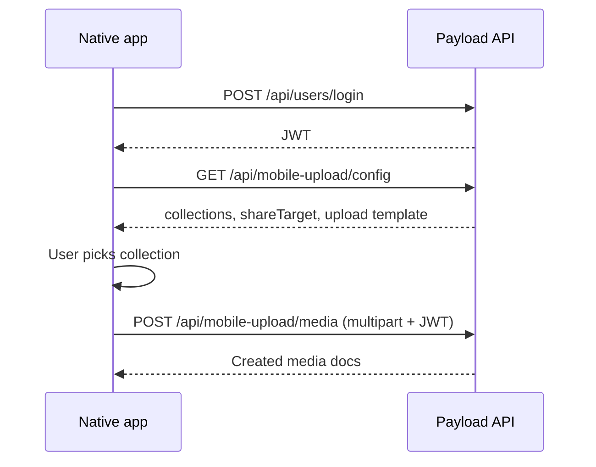

# payload-plugin-android-upload

Payload CMS plugin for mobile share-target uploads. Lets Android (and future iOS) clients authenticate to Payload, discover upload collections, and send media directly into upload collections such as `media` — with a permission-aware API and a lightweight web UI that reuses Payload’s own create form.

Built for [Payload 3.x](https://payloadcms.com) and Next.js.

## Features

- **Client setup endpoint** — one authenticated request returns available collections, the share-target URL, and the upload API template
- **Permission-aware collection discovery** — respects collection-level `create` access; only collections the user can create appear
- **Upload collection focus** — by default targets Payload upload collections (`collection.upload`, e.g. `media`), not every collection with an upload field
- **Multipart upload API** — native apps can POST files directly without the admin panel
- **Share-target web flow** — PWA manifest + standalone routes for Android share sheet / WebView
- **Payload create form** — upload collections render the same `Form` + `RenderFields` field components as admin create (without admin chrome)
- **Stateless plugin** — no extra collections, schema changes, or seed data added by the plugin itself

## Installation

```bash
pnpm add payload-plugin-android-upload
```

Peer dependency: `payload ^3.84.1`

## Quick start

Add the plugin to your Payload config:

```ts
import { buildConfig } from 'payload'
import { payloadPluginAndroidUpload } from 'payload-plugin-android-upload'

export default buildConfig({
  // ...
  plugins: [
    payloadPluginAndroidUpload({
      // optional — see Configuration
    }),
  ],
})
```

Wire up the share UI routes in your Next.js app (see [Host app routes](#host-app-routes)).

## Configuration

```ts
payloadPluginAndroidUpload({
  /** Whitelist specific collections. If omitted, auto-detect applies. */
  collections?: ['media'],

  /**
   * When true, also include document collections with upload fields
   * (e.g. posts with featuredImage). Default: false.
   */
  includeDocumentCollections?: false,

  /** Base path for the standalone share UI. Default: '/mobile-upload' */
  basePath?: '/mobile-upload',

  /** Override share POST handler path. Default: '{basePath}/share' */
  shareTargetPath?: '/mobile-upload/share',

  /** Disable endpoints while keeping the package installed */
  disabled?: false,
})
```

### How collections are detected

| Type | Identified by | Example | Included by default? |
|------|---------------|---------|----------------------|
| **Upload collection** | `upload` set on collection config | `media` | Yes |
| **Document with upload fields** | `type: 'upload'` fields on a normal collection | `posts` → `featuredImage` | No (use `includeDocumentCollections: true` or whitelist) |

Each collection in API responses includes `isUploadCollection: true | false`.

## API

All endpoints require authentication. Pass the Payload JWT from login:

```http
Authorization: JWT <token>
```

Base path: `/api` (or your configured `routes.api`).

### `GET /api/mobile-upload/config`

**Primary endpoint for native app setup.** Call once after the user logs in to Payload.

**Example response:**

```json
{
  "collections": [
    {
      "slug": "media",
      "labels": { "singular": "Media", "plural": "Media" },
      "isUploadCollection": true,
      "uploadFields": [
        { "name": "file", "relationTo": "media", "hasMany": false }
      ]
    }
  ],
  "shareTarget": {
    "url": "https://your-site.com/mobile-upload/share",
    "method": "POST",
    "enctype": "multipart/form-data"
  },
  "upload": {
    "urlTemplate": "https://your-site.com/api/mobile-upload/{collectionSlug}",
    "method": "POST"
  }
}
```

| Field | Use |
|-------|-----|
| `collections` | Populate the in-app collection picker |
| `shareTarget.url` | Android share intent / WebView target |
| `upload.urlTemplate` | Replace `{collectionSlug}` when uploading from the native app |

### `GET /api/mobile-upload/collections`

Returns `{ collections: UploadTarget[] }` — same collection list as `config`, without share/upload URLs. Kept for backwards compatibility.

### `POST /api/mobile-upload/:collectionSlug`

Multipart upload endpoint for native clients.

**Upload collection (`media`):**

- Body: `multipart/form-data` with one or more files under `file`
- Optional metadata via `_payload` JSON field (e.g. `{ "alt": "Description" }`)
- Response: `{ docs: [...], errors: [...] }`

**Document collection** (only when enabled via `includeDocumentCollections` or whitelist):

- Requires `uploadField` in `_payload` when the collection has multiple upload fields
- Uploads files to the related upload collection, then creates the document

All creates use `overrideAccess: false` and respect Payload access control.

## Native app flow



## Web share-target UI

Standalone mobile-friendly pages (no admin sidebar). Requires an authenticated Payload session or JWT.

| URL | Purpose |
|-----|---------|
| `/mobile-upload` | Collection picker |
| `/mobile-upload/:collection` | Payload create form for that collection |
| `/mobile-upload/share` | POST handler for Android share sheet (redirects to picker) |
| `/manifest.webmanifest` | PWA manifest with `share_target` (dev harness) |

For upload collections, the create form uses Payload’s `buildFormState`, `Form`, and `RenderFields` — the same field components as admin create, submitted to `POST /api/:collectionSlug`.

Unauthenticated users are redirected to `/admin/login?redirect=...`.

## Host app routes

The plugin registers API endpoints automatically. The share UI is exported for your Next.js app under the Payload layout.

**Example pages** (see [`dev/app/(payload)/mobile-upload/`](dev/app/(payload)/mobile-upload/)):

```tsx
// app/(payload)/mobile-upload/page.tsx
import config from '@payload-config'
import { ShareUploadPage } from 'payload-plugin-android-upload/rsc'
import { headers as getHeaders } from 'next/headers'
import { redirect } from 'next/navigation'
import { createPayloadRequest } from 'payload'

export default async function MobileUploadPage({ searchParams }) {
  const { filesToken } = await searchParams
  const headersList = await getHeaders()
  const host = headersList.get('host') ?? 'localhost:3000'
  const protocol = headersList.get('x-forwarded-proto') ?? 'http'

  const req = await createPayloadRequest({
    config,
    request: new Request(`${protocol}://${host}/mobile-upload`, {
      headers: headersList,
    }),
  })

  if (!req.user) redirect('/admin/login?redirect=/mobile-upload')

  return <ShareUploadPage filesToken={filesToken} pluginOptions={{}} req={req} />
}
```

**PWA manifest** (optional, for Android share target):

```ts
// app/manifest.ts
export default function manifest() {
  return {
    name: 'Payload Mobile Upload',
    start_url: '/mobile-upload',
    share_target: {
      action: '/mobile-upload/share',
      method: 'POST',
      enctype: 'multipart/form-data',
      params: {
        files: [{ name: 'files', accept: ['image/*', 'video/*', 'application/pdf'] }],
      },
    },
  }
}
```

## Package exports

| Import | Description |
|--------|-------------|
| `payload-plugin-android-upload` | Plugin factory + types |
| `payload-plugin-android-upload/client` | `CollectionPicker`, `ShareUploadForm` |
| `payload-plugin-android-upload/rsc` | `ShareUploadPage` server component |
| `payload-plugin-android-upload/share` | Share file store helpers |
| `payload-plugin-android-upload/files` | `getFilesFromRequest` utility |

## Local development

This repo includes a dev harness in [`dev/`](dev/).

```bash
pnpm install
pnpm dev
```

| URL | Description |
|-----|-------------|
| http://localhost:3000/admin | Payload admin |
| http://localhost:3000/mobile-upload | Share upload picker |
| http://localhost:3000/mobile-upload/media | Create media form |
| http://localhost:3000/api/mobile-upload/config | Client setup API |
| http://localhost:3000/manifest.webmanifest | PWA manifest |

**Default dev login:**

| | |
|---|---|
| Email | `dev@payloadcms.com` |
| Password | `test` |

Seeded automatically on first startup via [`dev/seed.ts`](dev/seed.ts).

### Database

Dev uses **SQLite** by default (`dev/payload.db`) — no MongoDB required.

To use MongoDB instead, create `dev/.env`:

```env
DATABASE_URL=mongodb://127.0.0.1/payload-plugin-android-upload
PAYLOAD_SECRET=dev-secret
```

See [`dev/.env.example`](dev/.env.example).

### Scripts

| Command | Description |
|---------|-------------|
| `pnpm dev` | Start Next.js dev server |
| `pnpm build` | Build plugin to `dist/` |
| `pnpm test:int` | Integration tests (Vitest) |
| `pnpm test:e2e` | Playwright admin smoke test |
| `pnpm generate:types` | Regenerate Payload types for dev harness |

## Dev collections

The dev harness includes:

- **`media`** — upload collection (`alt` field, local files in `dev/media/`)
- **`posts`** — document collection with `featuredImage` and `gallery` upload fields (only when `includeDocumentCollections: true`)
- **`users`** — auth collection

## Security notes

- All plugin endpoints require `req.user`; unauthenticated requests return `401`
- Local API calls use `overrideAccess: false` so collection access rules apply
- Set `serverURL` in Payload config in production so client setup URLs are absolute and correct

## License

MIT
